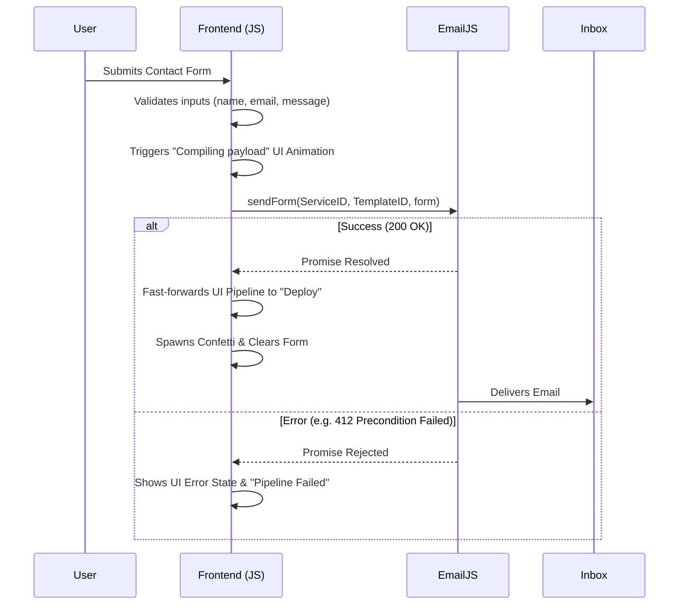
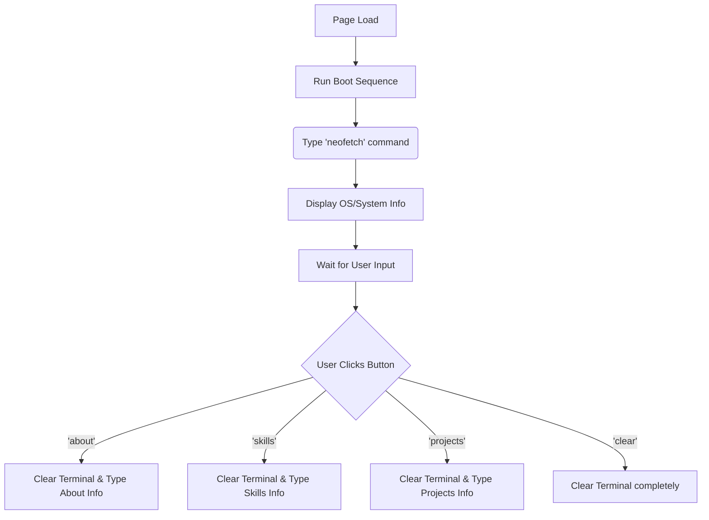

# Smit Bhanushali - .NET Cloud Engineer Portfolio

A premium, interactive, single-page portfolio website for **Smit Bhanushali**, a .NET Cloud Engineer specializing in C#, ASP.NET Core, Azure, and AWS.

---

## 📂 Project Structure

```text
Smit-portfolio/
├── index.html           # Main HTML structure, layout, and UI components
├── css/
│   └── style.css        # CSS variables, animations, responsive media queries, and themes
├── js/
│   ├── config.js        # Global configuration (EmailJS keys)
│   └── main.js          # Interactive features, modal data, form handling, and terminal logic
├── assets/
│   ├── profile.jpg      # Profile photo
│   └── Smit_Bhanushali_Resume.pdf # Downloadable resume
└── README.md            # Project documentation
```

---

## ⚙️ Architecture & Data Flows

### 1. Contact Form & Email Pipeline

The contact form uses **EmailJS** to securely transmit messages directly from the frontend to your inbox, without exposing a backend server. 



### 2. Interactive Terminal

The hero section features a simulated command-line interface. The terminal is self-contained within `main.js`.



### 3. Dynamic Skills Modal

To keep `index.html` clean, the detailed descriptions for each tech stack skill are managed dynamically in `js/main.js`. 

```mermaid
flowchart LR
    A[index.html<br>div data-skill='azure'] -->|User Clicks Card| B(main.js<br>Event Listener)
    B --> C{Lookup skillData['azure']}
    C --> D[Inject title, icon, What & Why into Modal]
    D --> E[Show Modal Overlay]
```

---

## 🛠️ Maintenance & Updating Content

### Updating the Tech Stack Details
If you want to modify the text that appears when you click a skill (e.g., Azure, C#, Entity Framework):
1. Open `js/main.js`.
2. Locate the `const skillData = { ... }` object near the bottom of the file.
3. Edit the `what` and `why` text for the corresponding skill key.

### Updating EmailJS Configuration
Your secure keys are isolated for best practice.
1. Open `js/config.js`.
2. Edit `EMAILJS_PUBLIC_KEY`, `EMAILJS_SERVICE_ID`, or `EMAILJS_TEMPLATE_ID`.
3. Save the file. No HTML changes are required.

### Replacing the Resume
1. Drop your new PDF into the `assets/` folder.
2. Ensure it is named exactly `Smit_Bhanushali_Resume.pdf`, OR update the `href` and `download` attributes of the "Download Resume" button in `index.html`.
